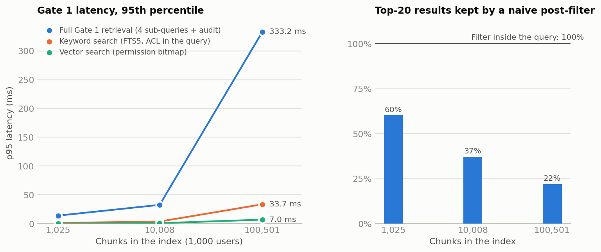

# Scale evidence: exact permission filtering at 100,501 chunks

Generated by `python scripts/benchmark.py` on 2026-09-26 14:13 UTC (Python 3.11.15, x86_64, 2 vCPU). Re-run it to reproduce;
`tests/test_scale.py` runs the same checks on smaller companies in CI.

**Result.** Across 900 permission-filtered queries on three synthetic companies of 1,000 users,
Gate 1 returned exactly the brute-force top 20 over the documents each asker may see, for keyword
and vector search alike, with platform, time-window and container filters: **0 mismatches and
0 results outside the asker's permissions**. At 100,501 chunks the full Gate 1 retrieval
for a question (four platform sub-queries, keyword and vector each, plus the audit-only shadow query)
took 120 ms at the median and 333 ms at p95 on one process.

<picture>
  <source media="(prefers-color-scheme: dark)" srcset="scale-dark.png">
  
</picture>

## Correctness and latency

p50 / p95 in milliseconds. "Post-filter keeps" is what the common shortcut would return: take the
top 20 over everything, then drop what the asker cannot see. It silently loses results (and its
latency and emptiness leak how much restricted material matched); filtering inside the query does not.

| Chunks | Documents | Queries | Keyword mismatches | Vector mismatches | Unpermitted results | Keyword ms | Vector ms | Full retrieval ms | Post-filter keeps |
|---:|---:|---:|---:|---:|---:|---:|---:|---:|---:|
| 1,025 | 172 | 300 | 0 | 0 | 0 | 0.4 / 1.3 | 0.1 / 0.2 | 4.7 / 14.1 | 60% |
| 10,008 | 1,719 | 300 | 0 | 0 | 0 | 1.3 / 3.8 | 0.3 / 0.9 | 14.8 / 32.7 | 37% |
| 100,501 | 17,192 | 300 | 0 | 0 | 0 | 10.1 / 33.7 | 3.0 / 7.0 | 119.9 / 333.2 | 22% |

## Ingestion and footprint

Every document went through the production path: the adapter fetched it over the (mock) platform
API, DLP masked it, it was chunked, embedded and written in one transaction per document.

| Chunks | Documents | Ingestion | Documents/s | Chunks/s | Vector index | Tokens per user, median |
|---:|---:|---:|---:|---:|---:|---:|
| 1,025 | 172 | 0.8 s | 212 | 1,266 | 1.0 MB | 40 (max 103) |
| 10,008 | 1,719 | 7.6 s | 227 | 1,323 | 10.2 MB | 44 (max 118) |
| 100,501 | 17,192 | 79.3 s | 217 | 1,267 | 102.9 MB | 31 (max 108) |

## What the synthetic companies contain

`internal_brain/evals/synthetic.py` generates 1,000 people (5% contractors: Slack guests with
external Drive accounts), about 70 groups, and documents on all four platforms with every ACL shape:
Confluence space grants, page restrictions (inherited down page trees, intersected when two sit on
one chain, and naming people who cannot see the space); Jira project roles and security levels
(including level members who cannot browse the project); public and private Slack channels, DMs and
guests; Drive shared-drive members, nested folder grants, per-file shares, owners and "anyone with
the link" (not a grant). Text comes from a pseudo-word vocabulary with per-container topic words, so
a question matches documents in containers the asker can and cannot see.

## How the check works

`internal_brain/evals/scale.py`, independent of the code under test:

- **Keywords:** the same FTS5 `MATCH` with no permission predicate and no `LIMIT`; rows filtered in
  Python by (document ACL tokens intersect the asker's tokens); first 20 kept.
- **Vectors:** every stored vector read from the `chunk_vectors` table (not the in-memory index),
  scored with numpy, permitted rows kept, top 20.
- Gate 1 must match the oracle score for score (ids equal up to ties at the 20th score).

## Caveats

- Vectors come from `SyntheticEmbedder` (a fixed random projection of the bag of words, 256
  dimensions): the permission filter and scoring are the production code, but embedding 100k chunks
  with the demo's hash embedder would measure Python hashing, not Gate 1. For reference, the hash
  embedder runs at 5,052 chunks/s on this machine; a hosted embedding
  model (Hunyuan) is batched in the sync worker.
- One process, SQLite in memory, Python 3.11.15, x86_64, 2 vCPU. At production scale the same shapes map onto a
  vector database with a metadata filter on allowed principals and a search service with
  document-level security; the Index interface stays the same.
- The same randomized method found two real over-grants in the Confluence and Jira projections
  (a person named in a page restriction without access to the space; a security-level member
  without browse permission). Gate 2 was already denying both at the source; the projections are
  now exact, and `tests/test_scale.py` keeps them so.
